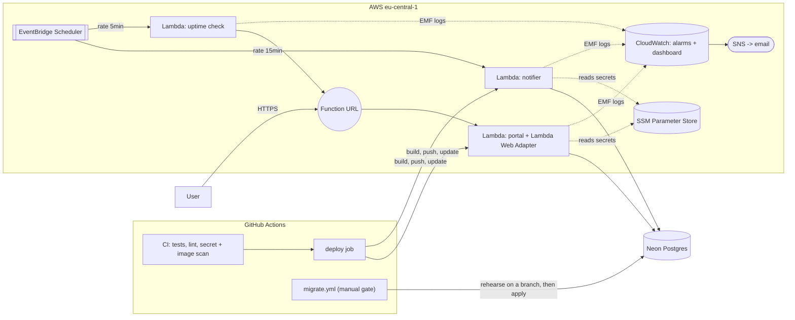

# wellis-status

Internal tool for the Wellis care team: look patients up by email, queue
appointment reminders. Two services over one Postgres database — a
Node/Express **portal** (API + auth) and a Python **notifier** (sends due
reminders, on a schedule). It used to run by hand on one GCP VM; this
repo replatforms it to serverless AWS + managed Postgres, with CI/CD,
monitoring, and access control as code.

If you're here for the take-home, start with `ASSIGNMENT.md`. See
`FINDINGS.md` for what was wrong going in and what changed,
`RUNBOOK.md` for on-call, `AGENT-NOTES.md` for how the agent work was
steered. All data is synthetic — no real person appears in it.

**Deployed URL:** _not live yet — the prod `terraform apply` is pending
the user's approval. See "IaC layout" below for what applying it does._

## Architecture



## Run it locally

```
make up
```

One command, no `.env` file. Builds both images, brings up Postgres, runs
migrations as the owner, seeds demo data, starts `portal`/`notifier`
connected as their own least-privilege DB roles. Prints the URL and a
`curl` example (a fixed local-only dev token is printed with it —
`/api` needs `Authorization: Bearer <token>`).

`make down` tears it down, `make logs` tails it, `make test` runs both
test suites in containers against the compose DB **as the app roles**,
not the owner, so the grants in `migrations/004_app_role_grants.sql` are
actually exercised. `make access-review` diffs `access/team.yaml`
against GitHub/SSH/SSM reality.

## Deploy & migrations

CI (`.github/workflows/ci.yml`) runs on every push and PR: `test` (the
full `make up && make test` path), `migration-lint` (squawk, only on
migrations newer than what's already applied to prod by hand),
`secrets` (gitleaks over full history), `images` (build + trivy scan,
CRITICAL/HIGH), `terraform` (fmt + validate).

On push to `main`, once everything else is green, `deploy` runs
`scripts/deploy.sh`: builds both images for `linux/amd64`, tags them
with the full git SHA (ECR tags are immutable), **checks that every
`migrations/*.sql` file is already recorded in prod's
`schema_migrations`** — refuses to deploy code otherwise — pushes to
ECR, calls `update-function-code` on both Lambdas and waits, then smoke
tests `/healthz` and `/api/summary`. A failed smoke test rolls both
functions back to the image that was live before. The same script runs
identically by hand from a laptop.

Migrations are **not** run by CI automatically. `.github/workflows/
migrate.yml` is `workflow_dispatch`-only, gated behind typing
`migrate-prod` as an input — a free private repo can't have
required-reviewer branch protection, so this is the human gate instead.
It rehearses the pending migrations on a throwaway Neon branch (same
role/password as prod, just a different host — child branches inherit
both) before ever touching prod, and deletes the branch whether the
rehearsal passed or not.

Rule the deploy guard exists to enforce: **schema goes first, code
second**, and code has to work against the schema that was live a
minute ago, not just the one it expects.

## IaC layout

- `infra/terraform/bootstrap/` — the S3 state bucket and the GitHub OIDC
  provider. Local state (it creates the bucket its own state later
  moves into). Applied once, by hand.
- `infra/terraform/prod/` — everything else: the Neon project (imported,
  not recreated), `wellis_owner`/`portal_app`/`notifier_app` DB roles,
  SSM params, two ECR repos, both app Lambdas, the uptime Lambda, both
  EventBridge schedules, SNS + 5 alarms + 1 dashboard, the GitHub deploy
  role.

Apply order, chicken-and-egg (a Lambda needs an image before it can
exist; the deploy role needs the functions before it can be scoped to
them — full sequence is in `variables.tf`):

1. Apply `bootstrap/`.
2. `terraform apply -target=aws_ecr_repository.portal -target=aws_ecr_repository.notifier` in `prod/`.
3. Build and push both images by hand, once, tagged with a real git SHA.
4. `terraform apply -var image_tag=<sha>` — the full apply.

After that, CI deploys by pushing new images and calling
`update-function-code` directly, not `terraform apply` —
`lifecycle.ignore_changes` on `image_uri` keeps a later plan from
rolling a Lambda back to whatever tag was last planned here.

## Key decisions

- **Lambda over Fargate/k8s.** Two low-traffic internal services; paying
  for always-on containers (or running a control plane) doesn't match
  the load. Reserved concurrency (5 for portal, 1 for notifier) caps
  cost and DB connections directly, in one setting.
- **Neon over self-hosted Postgres.** Managed backups/PITR, branching
  (used for migration rehearsal, below), scale-to-zero on the free
  tier. The box that used to run Postgres doesn't exist anymore.
- **App-level named tokens, not SSO/IAP, for now.** A handful of
  internal users hitting one endpoint doesn't justify standing up real
  SSO yet. Named, hashed, individually revocable tokens
  (`portal/src/auth.js`) get most of the accountability for a fraction
  of the infrastructure — see "What I'd do next."
- **SSM read at cold start, refreshed lazily every 5 minutes.** Keeps
  secrets out of the image/build entirely; the refresh means a revoked
  token or a rotated URL takes effect without a redeploy.
- **Notifier runs every 15 minutes.** Reminders are always hours out, so
  nothing needs a tighter loop, and it lets Neon's compute actually
  scale to zero between runs instead of being kept warm by us.
- **Expand/contract migrations.** Migration 003 adds columns and
  backfills via trigger; it never touches the old column. Schema and
  code can each ship independently of the other — which is also why the
  deploy guard above can exist at all.
- **No staging environment.** A real staging environment is a second
  environment to keep alive and in sync, for a two-person team's
  internal tool. A Neon branch rehearsal gets most of the value — real
  schema, real data shape, thrown away right after — one migration at a
  time, without that upkeep.

## Lock-in

What's portable, and what a move off AWS/Neon would actually cost:

| Coupling | Welded to | Moving it |
|---|---|---|
| Compute | Docker images (OCI-standard) | Portable — same images run on Fargate/Cloud Run/anywhere, no code change |
| Database | Postgres wire protocol | Portable — Neon *is* Postgres; RDS, Cloud SQL, or self-hosted all work with a connection-string swap |
| Config | Environment variables | Portable — every app just reads `DATABASE_URL`/etc, regardless of source |
| Portal's runtime shim | Lambda Web Adapter (in the image) | Moderate — one layer bridging the container to Lambda's invoke model; remove it and the same image runs anywhere that takes a long-running HTTP server |
| Scheduling | EventBridge Scheduler | Low — two cron-shaped triggers (15 min, 5 min); any scheduler does the same job |
| Secrets | SSM Parameter Store | Moderate — `load_ssm_params.{js,py}` is the one AWS-specific module per app; swapping the store is a contained change there |
| Metrics | CloudWatch EMF (a JSON log convention) | Moderate — the data itself isn't AWS-specific, only how it's shipped; `emf_log()`/`handler.py` are the two places that would change |

## What I'd do next

- Actually decommission the old GCP VM/project — nothing in this repo
  does that; it's a manual step outside this repo's scope.
- A real external uptime check (a different provider, not just outside
  this AWS account) — the current one shares a failure domain with the
  thing it's checking; documented in `uptime/handler.py`.
- Get patient email out of the URL query string
  (`GET /api/patients?email=...`) — still lands in any intermediary's
  access logs today.
- SSO/IAP for the portal, once there's an identity provider worth
  wiring up to.
- SHA-pin GitHub Actions (currently pinned to major version tags — a
  deliberate first cut, documented in `ci.yml`).
- Dependency vulnerability scanning for app code (npm/pip), not just
  container images.

Not covered above: `access/team.yaml` is the source of truth for who
has access to what (`scripts/access/access.py` reviews and offboards
against it); `ops/` is what's left of the old box (crontab, SSH keys).
